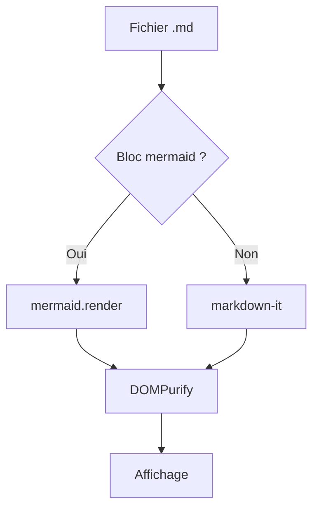
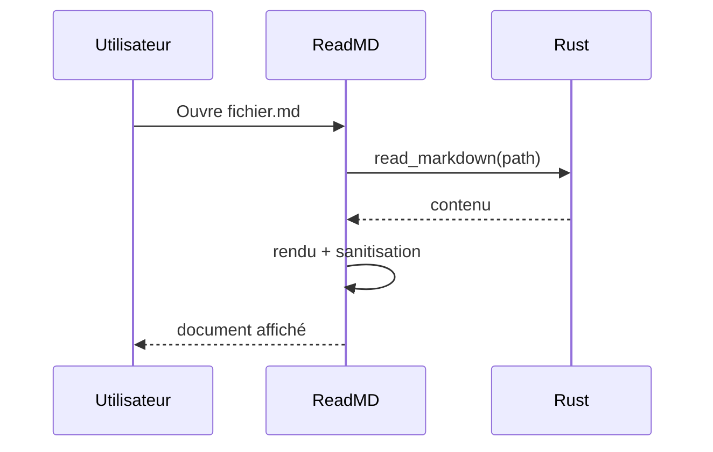

# ReadMD — fichier de démonstration

Ce document sert à valider **visuellement** le rendu de ReadMD : titres, typographie,
listes, tableaux, code, diagrammes et liens. Si tout s'affiche correctement et proprement,
le pipeline de rendu fonctionne.

> 💡 _Astuce_ : modifiez les couleurs et la police depuis le panneau de réglages,
> puis revenez ici — l'aperçu se met à jour en direct.

---

## 1. Titres et sous-titres

Le H1 ci-dessus doit être **bleu**, et les sous-titres (H2/H3) d'un **bleu plus foncé**
par défaut. Ces couleurs sont personnalisables.

### Sous-titre de niveau 3

#### Sous-titre de niveau 4

Un paragraphe normal, avec du *texte en italique*, du **texte en gras**, du `code en
ligne`, du ~~texte barré~~ et un lien vers [le site de Tauri](https://tauri.app).

## 2. Listes

Liste à puces :

- Premier élément
- Deuxième élément
  - Sous-élément imbriqué
  - Autre sous-élément
- Troisième élément

Liste numérotée :

1. Étape une
2. Étape deux
3. Étape trois

Liste de tâches (GFM checklist) :

- [x] Rendu Markdown de base
- [x] Coloration syntaxique
- [ ] Export PDF (hors périmètre V1)
- [ ] Multi-onglets (hors périmètre V1)

## 3. Citations

> Ceci est une citation.
>
> > Et une citation imbriquée, pour vérifier l'indentation.

## 4. Tableau (GFM)

| Fonctionnalité       | Statut      | Plateforme       |
| -------------------- | :---------: | ---------------- |
| Rendu GFM            | ✅ Complet   | macOS + Windows  |
| Mermaid              | ✅ Lazy      | macOS + Windows  |
| Thème clair / sombre | ✅           | Suit le système  |
| Édition              | ❌ Hors V1   | —                |

## 5. Code multi-langage

JavaScript :

```js
// Détection naïve d'un bloc mermaid
function isMermaid(lang) {
  return lang.trim().toLowerCase() === "mermaid";
}
console.log(isMermaid("mermaid")); // true
```

Rust :

```rust
#[tauri::command]
fn read_markdown(path: String) -> Result<String, String> {
    std::fs::read_to_string(&path).map_err(|e| e.to_string())
}
```

Python :

```python
def fib(n: int) -> int:
    a, b = 0, 1
    for _ in range(n):
        a, b = b, a + b
    return a
```

Bloc de code sans langage :

```
texte brut, pas de coloration
```

## 6. Diagramme Mermaid



Et un diagramme de séquence :



Un diagramme volontairement **invalide** (doit afficher un encadré d'erreur, sans casser le reste) :

```mermaid
flowchart TD
    A --> ??? this is not valid
```

## 7. Images

Image distante (nécessite le réseau) :


Image locale (placeholder — remplacez par un fichier réel à côté du document) :


## 8. Liens et séparateurs

- Lien externe : <https://www.markdownguide.org/>
- Lien vers une ancre interne : [retour aux titres](#1-titres-et-sous-titres)

---

Fin du document de démonstration. 🎉
